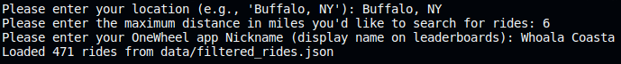
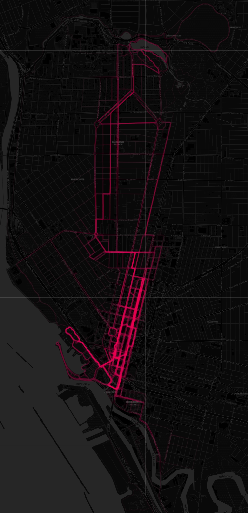

# OneMap OneWheel Ride Aggregator

This project is designed to aggregate and visualize a user's OneWheel app rides based on a user-specified location.

## How?

### 1. **Fetching General Ride Data**:

The program starts by retrieving general ride details from the endpoint: 
```
https://app.onewheel.com/wp-json/fm/v2/trails
```

### 2. **User Input**:

The user is prompted to provide:
- A location (e.g., 'Buffalo, NY')
- Maximum search distance in miles
- OneWheel app nickname (as displayed on leaderboards)




### 3. **Filtering Rides**:

With the user input, the program filters rides based on the provided location using the `haversine_distance` function. This function calculates the distance between two latitude and longitude points and helps identify rides within the specified radius.

### 4. **Augmenting Ride Data**:

Before diving into the augmentation process, it's important to note that the trail and localized filter data fetched initially will include **ALL** rides in the specified area. The program then individually checks each ride to determine if the user matches the provided input. Due to this, if a large area is specified, the process can be time-consuming.

For each filtered ride:
- Details are fetched from: 
```
https://app.onewheel.com/wp-json/fm/v2/trails/1?trackId={ride_id}
```
- If the ride matches the user's nickname, further detailed coordinates for the ride are fetched from:
```
https://app.onewheel.com/wp-json/fm/v2/trailscoordinates/{ride_id}
```
This data is saved locally for further processing.


### 5. **Visualization**:

After aggregating ride data, the `folium` library is utilized to plot the rides on a dark-themed map. Each ride is represented as a path.



To view and explore the aggregated map:
1. Navigate to the local path where `rides_map_dark.html` is saved.
2. Open `rides_map_dark.html` in your preferred web browser. 

You can also view an example map [here](example_map.html).

## Prerequisites

- Python 3.x
- Required Python packages: `requests`, `folium`, `geopy`

## Setup

1. **Clone the repository**:
   ```bash
   git clone https://github.com/whoalacoasta/onemap
   ```

2. **Set up a virtual environment**:
   
   Navigate to the project directory and create a virtual environment:
   ```bash
   python -m venv .venv
   ```

   Activate the virtual environment:
   - On Windows:
     ```bash
     .\.venv\Scripts\activate
     ```
   - On macOS and Linux:
     ```bash
     source .venv/bin/activate
     ```

3. **Install required packages**:
   ```bash
   pip install -r requirements.txt
   ```

## Configuration:

1. **Rename `config_example.py` to `config.py`**:
   ```bash
   mv config_example.py config.py
   ```

2. **Update `config.py` with the necessary headers and cookies**:

   These can be obtained by inspecting the network requests made while browsing public rides.

   - Open the [OneWheel browser app](https://app.onewheel.com/rides.html).
   - Right-click and select 'Inspect' or press `Ctrl+Shift+I` (or `Cmd+Option+I` on Mac).
   - Navigate to the 'Network' tab.
   - Refresh the page or interact with the website or perform actions that trigger the relevant requests (e.g., viewing ride details).
   - Filter the requests to locate the specific endpoints used in this project, such as `https://app.onewheel.com/wp-json/fm/v2/trails` and related endpoints (I.E. filtering by "v2" would work).
   - Once you identify a relevant request, click on it and copy the 'Request Headers' and 'Cookies' to use in the `config.py` file.

## Usage

Navigate to the project directory (ensure your virtual environment is activated) and execute:
```bash
python run.py
```

## Contributing

Pull requests are welcome. For significant changes, please open an issue first to discuss.

## License

[MIT](https://choosealicense.com/licenses/mit/)
